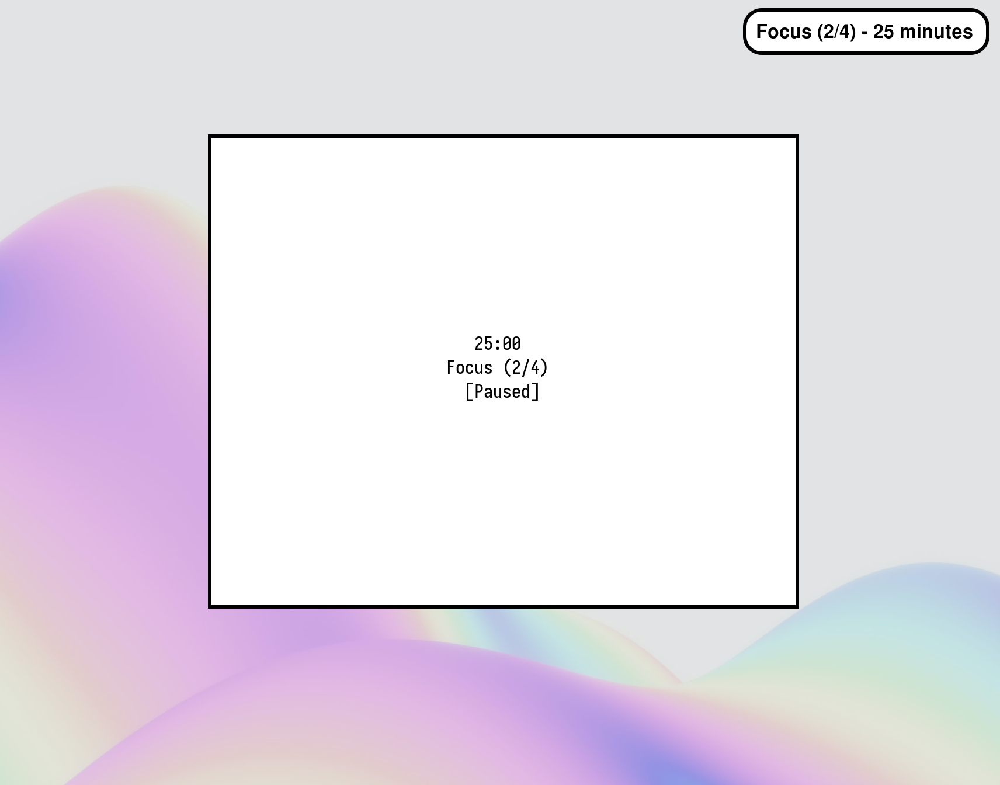

# termato

`termato` is a simple TUI pomodoro timer which can run arbitrary commands upon state change.



Licensed under [GPL-3.0](./LICENCE). To build `termato`, follow the [compilation instructions](#building).

*Disclaimer: `termato` is not yet stable and is subject to change in upcoming versions.*

### Examples

You can use the `--notify` flag to run an arbitrary command upon state change. For example, if you had `notify-send`
installed, you could run
```sh
$ termato --notify "notify-send 'termato: %s'"
```
The `%s` format specifier is replaced with information about the new work or break period:


### Usage
```
termato <OPTION>...

KEYBINDS:
SPACE	pause or unpause your session
s	skip to the next period

OPTIONS:
  -f, --focus <NUM>
	specify the length of focus periods, in minutes (default: 25)
  -b, --short-break <NUM>
	specify the length of short break periods, in minutes (default: 5)
  -l, --long-break <NUM>
	specify the length of long break periods, in minutes (default: 20)
  -s, --sessions <NUM>
	specify the number of work periods before a long break (default: 4)
  -n, --notify <STR>
	specify a command to run upon timer state change (default: none)
	The first occurrence of `%s` will be substituted with the new timer state
  -h, --help
	display this help and exit
      --version
	output version information and exit
```

### Building

You will need:

- `git`
- a C99 compiler, such as `gcc` or `clang`
- a `make` implementation, such as `gnumake`
- `ncurses`

Using `git`, clone the source code and navigate to the desired release, where `X.X` is the version number. Building from
the `master` branch is discouraged.
```sh
$ git clone https://github.com/felix-u/termato
$ git checkout vX.X
```

To compile an optimised binary at `./termato` relative to this repository's root directory, run:
```sh
$ make release
```

To compile this binary *and* copy it to `~/.local/bin`, run:
```sh
$ make install
```
